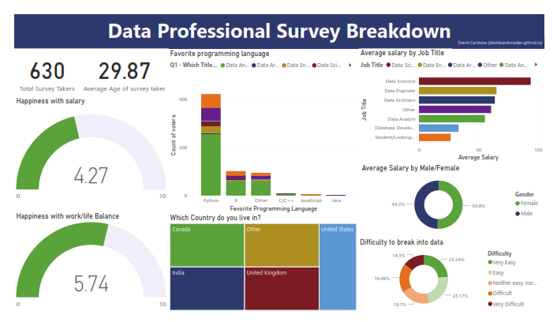

# Data Professional Survey Breakdown Dashboard Project in Power BI

## Overview
This Power BI project focuses on analyzing survey data from data professionals to gain insights into various aspects of their roles, satisfaction levels, demographics, and more. The dashboard aims to provide a comprehensive view of the survey results through interactive visualizations.

## Dataset
The dataset contains survey responses from data professionals and includes the following fields:
- Email
- Date Taken (America/New_York)
- Time Taken (America/New_York)
- Browser
- OS
- City
- Country
- Referrer
- Time Spent
- Q1 - Which Title Best Fits your Current Role?
- Q2 - Did you switch careers into Data?
- Q3 - Current Yearly Salary (in USD)
- Q4 - What Industry do you work in?
- Q5 - Favorite Programming Language
- Q6 - How Happy are you in your Current Position with the following? (Salary, Work/Life Balance, Coworkers, Management, Upward Mobility, Learning New Things)
- Q7 - How difficult was it for you to break into Data?
- Q8 - If you were to look for a new job today, what would be the most important thing to you?
- Q9 - Male/Female?
- Q10 - Current Age
- Q11 - Which Country do you live in?
- Q12 - Highest Level of Education
- Q13 - Ethnicity

## Charts Created
1. **Happiness with Salary and Work-Life Balance Gauges**: Two gauges representing respondents' happiness levels with salary (4.7 out of 10) and work-life balance (5.74 out of 10) provide insights into job satisfaction metrics.
2. **Favorite Programming Language by Job Title Stacked Columns**: A stacked column chart showcases the distribution of favorite programming languages among respondents, categorized by job titles.
3. **Geographical Distribution of Respondents Treemap**: A treemap visualizes the geographical distribution of respondents, highlighting countries where data professionals are predominantly located, such as Canada, India, UK, and USA.
4. **Job Titles Counts Clustered Bar Chart**: A clustered bar chart displays the frequency of different job titles among respondents, with categories including Data Scientist, Data Engineer, and Data Architect.
5. **Average Salary by Gender Donut Chart**: A donut chart illustrates the average salary breakdown by gender, revealing a slight gender imbalance with females earning 50.8% and males earning 49.2% on average.
6. **Perceived Difficulty of Breaking into Data Donut Chart**: Another donut chart visualizes respondents' perceptions of the difficulty of breaking into the data field, with categories ranging from Very Easy (23%) to Very Difficult (14%).

## Dashboard
The Power BI dashboard provides interactive visualizations that allow users to explore survey data and gain insights into various aspects of data professionals' roles, satisfaction levels, demographics, and more.

## Key Findings
1. **Job Satisfaction**: Survey respondents generally express moderate levels of job satisfaction, with average ratings of 4.7 out of 10 for salary happiness and 5.74 out of 10 for work-life balance.
   
2. **Geographical Distribution**: The majority of respondents are located in Canada, India, UK, and USA, indicating a global participation in the survey.

3. **Job Titles Distribution**: The most common job titles among respondents include Data Scientist, Data Engineer, and Data Architect, highlighting the prevalence of technical roles within the data profession.

4. **Gender Pay Gap**: There is a slight gender imbalance in average salary, with females earning slightly more on average (50.8% vs. 49.2% for males), suggesting potential disparities in compensation based on gender.

5. **Perceived Difficulty of Entering the Field**: Respondents' perceptions of breaking into the data field vary, with 23% finding it very easy, 23% easy, 19% neither easy nor difficult, 19% difficult, and 14% very difficult, indicating a mix of experiences in entering the industry.

6. **Factors Influencing Job Search**: When asked about the most important factor in seeking a new job, respondents prioritize different aspects, providing insights into their motivations and priorities in career development.

## Conclusion
The Power BI dashboard provides valuable insights into the survey responses of data professionals, highlighting areas of satisfaction, demographics, and challenges within the field. Further analysis and exploration of the data can help stakeholders make informed decisions and improve the overall experience of data professionals.

--- 
**Colophon**  

thanks Alex for his tutorials and explanations ([Alex The Analyst](https://www.alextheanalyst.com/))